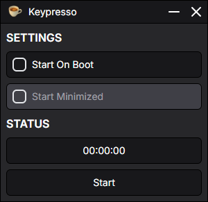

# ⌨️ Keypresso - Never Go AFK Again

**Keypresso** is a lightweight anti-AFK (Away From Keyboard) utility built with Electron. It simulates a `Shift` keypress every 5 minutes to keep your system or application active, perfect for long-running sessions where inactivity detection is a concern.

It offers a clean UI, background operation with a system tray, and convenient startup options.

---

<p align="center">
  
</p>

---

### 📦 Download

Grab the latest release from the official GitHub page:

➡️ [Download Keypresso](https://github.com/ritztoston/keypresso/releases)

---

### ✨ Features

-   🕒 **Anti-AFK Automation**: Presses the `Shift` key every 5 minutes when running.
-   🛠️ **Settings Panel**:
    -   **Start on System Boot**.
    -   **Start Minimized** (only when opened at login).
-   🧳 **System Tray Support**:
    -   Start/Stop automation from tray.
    -   Double-click tray icon to restore app.
    -   Close to tray or quit entirely.
-   🪟 **Frameless and Minimal UI**: A sleek, transparent interface optimized for unobtrusive use.

---

### 🧰 Installation

1. Clone the repository:

    ```bash
    git clone https://github.com/yourusername/keypresso.git
    cd keypresso
    ```

2. Install dependencies:

    ```bash
    npm install
    ```

3. Run the app in development:

    ```bash
    npm run dev
    ```

4. Build for production:

    ```bash
    npm run build
    ```

---

### 🚀 Usage

Once launched:

-   Click **Start** to begin sending periodic `Shift` key presses.
-   Click **Stop** to pause the automation.
-   Configure **Start on Boot** and **Start Minimized** under the app's settings.
-   Close the window to minimize to system tray (does **not** quit the app).

Right-click the tray icon for quick actions:

-   Toggle **Start / Stop**
-   **Quit** the app

---

### 📁 Settings Storage

Keypresso saves settings to:

```
<userData>/settings.json
```

Managed settings include:

-   `startMinimized`: Whether the app should start hidden on boot.

---

### 🔒 Permissions

Keypresso uses `robotjs` for key simulation. No user input is logged or monitored.

---

### 🛠 Development Notes

-   System tray icon loads from:
    -   Development: `public/logo.png`
    -   Production: `resources/public/logo.png`
-   Main app entry point: `main.js`
-   Renderer preload script: `preload.js`

---

### 📜 License

MIT License
